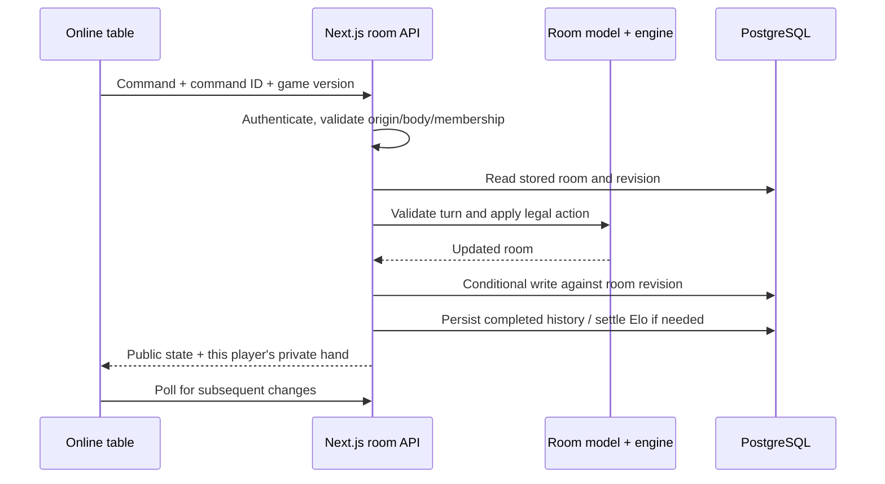

# Truco — la mesa venezolana

A browser game for Venezuelan Truco, with Spanish interface copy, private or public tables, 1v1 duels and 2v2 teams. Players can practice against Truquito, invite friends, compete for Elo, and opt into room voice and camera.

This repository is migrating from Sites to **Next.js on Vercel, Supabase Auth/Postgres, and optional LiveKit media**. The migration branch is `codex/vercel-launch`; the existing Sites deployment is separate. The intended address is [truco-ve.vercel.app](https://truco-ve.vercel.app), but the hosted migration is **not ready for public play**. See [launch status](#launch-status) before deploying.

## What is implemented

- **Casual rooms:** public listings, six-character invitation codes, private tables, seats, ready checks, host controls, reconnection, room chat, and agreed rules.
- **Competitive:** confirmed accounts, fixed rules, separate 1v1/2v2 Elo, automatic matchmaking, forfeits, peak rating, and durable results. The 2v2 queue balances four solo entrants; premade party queues are not implemented.
- **Accounts:** Supabase flows for Google, Facebook, Apple, and email/password; guest access; email confirmation and password recovery. Providers need external configuration before these flows work live.
- **Profiles:** display name, unique username, biography, friend requests, current/peak Elo, and finished online match history with opponents and results. Account labels in play and chat come from the server.
- **Table interaction:** branched canto menus, clear pending-canto notices, click or drag to play, and a separate stack of played cards for each player. Ordinary visual stacking does not change turn order; the special first-parda rule has its own engine action.
- **Communication:** floating global chat, room chat, optional voice, and separately optional cameras. Microphone/camera start off; there is no recording or transcription.
- **Practice:** three local AI difficulties and optional explanations. Truquito is a rule-based bot, not an LLM, and receives only its legal player view.
- **Installation:** a web app manifest and service worker. It caches the icon and manifest only; it does not make online matches available offline.

[Game rules](docs/RULES.md) · [Competitive rules](docs/COMPETITIVE.md) · [Voice setup](docs/VOICE_SETUP.md) · [Vercel and Supabase setup](docs/VERCEL_SETUP.md)

## Technologies and their jobs

Versions below describe the current major versions; `package-lock.json` pins the exact installation.

| Technology                                | Role                                                                                                   |
| ----------------------------------------- | ------------------------------------------------------------------------------------------------------ |
| Node.js 22.13+ and npm                    | Runtime, package management, and built-in test runner                                                  |
| Next.js 16, App Router                    | Pages, server route handlers, auth callbacks, and deployment on Vercel                                 |
| React 19 and strict TypeScript 5          | Interactive table/lobby UI and typed game logic                                                        |
| Tailwind CSS 4 and `app/globals.css`      | Utilities, tokens, responsive layouts, and table styling                                               |
| Base UI, shadcn source components, Lucide | Accessible dialogs/popovers/controls and icons; only used UI components are retained                   |
| Supabase Auth and `@supabase/ssr`         | Social/email identities, anonymous guests, and cookie sessions                                         |
| PostgreSQL and `postgres`                 | Persistent rooms, profiles, friendships, rankings, history, and chat; direct parameterized SQL, no ORM |
| PGlite                                    | Local-only PostgreSQL-compatible database for development and HTTP checks                              |
| LiveKit                                   | Optional realtime audio/video; a separate media service, not the game-state transport                  |
| Web Crypto                                | Secure IDs, randomness, and signing scoped LiveKit tokens                                              |
| Oxlint, Oxfmt, TypeScript                 | Lint, formatting, and type checks                                                                      |

There is no separate Express server, Redis, WebSocket game server, external AI API, or payment system. Browser clients call this application's API; room and chat updates use polling.

## Run locally

From the repository root, with Node **22.13 or later**:

```sh
npm ci
TRUCO_LOCAL_DATABASE=/tmp/truco-local-db TRUCO_LOCAL_TEST_AUTH=1 npm run dev -- --port 3013
```

Open [localhost:3013](http://localhost:3013). PGlite initializes the SQL schema in the chosen directory. Reuse that directory to retain local data; use another empty directory for a fresh database. The local auth switch supplies isolated HttpOnly test identities, so cloud accounts are not required for these checks. **Neither local switch works in production, and neither belongs in Vercel settings.**

For real authentication, copy `.env.example` to `.env.local`, fill in Supabase values, apply the migration to that database, and start without the test switches:

```sh
cp .env.example .env.local
npm run dev -- --port 3013
```

Do not run HTTP integration suites against a real user database. They create test users, rooms, chat, friendships, and results. They are restricted to localhost, but you must also point that local server at a disposable local database.

### Environment variables

| Variable                                | Used by                                      | Purpose                                                                                                            |
| --------------------------------------- | -------------------------------------------- | ------------------------------------------------------------------------------------------------------------------ |
| `NEXT_PUBLIC_SITE_URL`                  | Server metadata                              | Base origin for metadata links; use `http://localhost:3013` locally and the chosen production domain when deployed |
| `NEXT_PUBLIC_SUPABASE_URL`              | Browser/server                               | Supabase project URL                                                                                               |
| `NEXT_PUBLIC_SUPABASE_PUBLISHABLE_KEY`  | Browser/server                               | Publishable auth key; designed for client use                                                                      |
| `DATABASE_URL`                          | Server only                                  | Supabase transaction-pooler URL, port 6543; certificate-verified TLS, prepared statements disabled                 |
| `LIVEKIT_URL`                           | Server; supplied to authorized media clients | Secure `wss://` media endpoint                                                                                     |
| `LIVEKIT_API_KEY`, `LIVEKIT_API_SECRET` | Server only                                  | Media token signing and participant removal                                                                        |
| `TRUCO_LOCAL_DATABASE`                  | Development/test only                        | PGlite data directory                                                                                              |
| `TRUCO_LOCAL_TEST_AUTH=1`               | Development/test only                        | Explicit test-cookie authentication                                                                                |
| `TRUCO_TEST_URL`                        | Test scripts only                            | Local HTTP test target; defaults to port 3013, or 3014 for production-auth checks                                  |

Secrets must stay in `.env.local` or the hosting provider's environment settings. Never prefix database or LiveKit credentials with `NEXT_PUBLIC_`. `.env.local` and `.vercel/` are ignored by Git.

## Codebase map

```text
app/
  page.tsx, layout.tsx       Entry page, metadata, fonts, global styles
  globals.css               Design tokens, lobby/table/account layouts
  api/                      Server-authoritative HTTP endpoints
  auth/                     OAuth/email callbacks and password recovery
components/
  truco-app.tsx             Screen orchestration, invitations, dialogs
  lobby-view.tsx            Casual/competitive tabs and room discovery
  room-view.tsx             Waiting room, seats, ready/start controls
  online-table.tsx          Table driven by a server-projected game state
  game-table.tsx            Local practice table and bot turns
  table-context.tsx         Pending canto and played-card history/stacks
  account-menu.tsx          Account entry, guest upgrade, sign-in/out
  profile-panel.tsx         Profile, friends, and match history
  matchmaking.tsx           Queue lifecycle and assignment into rooms
  ranking-panel.tsx         Rating and leaderboard display
  global-chat.tsx            Floating global chat
  room-chat.tsx, voice-room.tsx  Room text and LiveKit controls
  room-dialogs.tsx          Create/practice/rules dialogs
  ui/                      Small set of used shared UI primitives
hooks/use-room.ts           Room requests, polling, reconnect, actions
lib/
  truco-rules.ts            Card hierarchy and Venezuelan rule calculations
  truco-engine.ts           Pure game state transitions and player projections
  command-validation.ts    Runtime validation of game commands
  room-model.ts            Room membership, settings, actions, and projections
  practice-ai.ts           Bot policy using only permitted information
  card-drag.ts             Mouse/touch card-drag behavior
  game-copy.ts             Spanish turn/canto explanations
  rating.ts                Elo math and leaderboard types
  auth/                    Browser/server Supabase clients and return paths
  server/                  Database, identity, rooms, history, Elo, queue, media
proxy.ts                   Supabase cookie-session refresh
supabase/migrations/       Versioned PostgreSQL schema
public/                    Static art, icon, manifest, service worker
tests/                    Unit and HTTP integration checks
docs/                     Rules and external service setup guides
```

### How an online move travels



`truco-engine.ts` is independent of HTTP, React, authentication, and storage. Both online games and practice use it. Change a rule there (or in `truco-rules.ts`), add a rule/engine regression check, then update the matching explanation in `docs/RULES.md` and `game-copy.ts` as needed.

The server keeps the complete room and hands. A player receives public information plus their own private hand. The browser cannot submit a winner, choose its Elo change, or authorize itself by supplying a display name or profile label.

Room changes use revision-based compare-and-swap and retry conflicts; game command IDs prevent duplicate plays. Database write batches use transactions and a shared PostgreSQL advisory lock. This is intentionally simple and has a throughput ceiling: use finer per-player locks if measured write contention requires them. Do not remove concurrency checks while changing storage.

Rooms poll every **1.5 seconds when visible**, **5 seconds when hidden**, with heartbeats around every **10 seconds**. Global chat polls every **4 seconds while open and visible**; the lobby refreshes every **15 seconds while visible**. LiveKit carries audio/video independently.

### Identity and account boundaries

Production identity comes from the server-verified Supabase user. A registered player is non-anonymous with a confirmed email. Anonymous guests may play casual rooms; competitive creation/joining, matchmaking, and profile/friend access require a confirmed account.

A guest can upgrade the same Supabase identity, preserving its online data. Logging into an already-existing account switches identities; it does not merge histories by display name. OAuth/email return paths are kept local to the app. The local test cookie and legacy ChatGPT proxy headers are not production credentials.

### Persistence

The initial schema is [`supabase/migrations/20260912000000_truco.sql`](supabase/migrations/20260912000000_truco.sql). Apply it before using a fresh hosted database; normal production requests do not create the schema.

| Table               | Stores                                                                                       |
| ------------------- | -------------------------------------------------------------------------------------------- |
| `rooms`             | Serialized authoritative room/game state, invitation code, owner, status, revision, activity |
| `profiles`          | User ID, unique handle, display name, biography, creation time                               |
| `friendships`       | Sender/recipient relationship and request/acceptance state                                   |
| `ratings`           | Current and peak Elo, rated games and wins per format                                        |
| `ranked_results`    | One settlement record per competitive room, including unrated capped results                 |
| `match_history`     | Completed online game result for each participant                                            |
| `matchmaking_queue` | Queue tickets, format/rating, activity, room assignment                                      |
| `global_messages`   | Global chat messages and trusted author identity                                             |

All game tables have RLS enabled and no public client policies. Only the server database connection accesses them. Room chat and pending media revocations are part of stored room data. API responses are `no-store`; the service worker never caches them.

Rooms become inaccessible after **48 hours of inactivity**; rows are not automatically deleted. Public listings only show recently active waiting rooms. Completed match history persists separately. Local practice and its resume snapshot stay in browser storage and never affect competitive Elo or online history.

### API guide

| Route                             | Methods   | Purpose                                                                            |
| --------------------------------- | --------- | ---------------------------------------------------------------------------------- |
| `/api/account`                    | GET       | Current verified account/test identity                                             |
| `/api/rooms`                      | GET, POST | Public room listing/service availability; create a room                            |
| `/api/rooms/[id]`                 | GET, POST | Member state; join by ID/code, ready/start, commands, chat, heartbeat, leave/close |
| `/api/rooms/[id]/voice`           | POST      | Room-scoped, short-lived LiveKit token for an active member                        |
| `/api/matchmaking`                | GET, POST | Inspect/join/poll/cancel competitive queue                                         |
| `/api/ranking?format=1v1`         | GET       | Leaderboard and caller's rating/recent ranked results; also accepts `2v2`          |
| `/api/profile`                    | GET, POST | Profile/friend/history reads and profile/friend mutations                          |
| `/api/chat`                       | GET, POST | Global chat history and message send                                               |
| `/auth/callback`, `/auth/confirm` | GET       | OAuth code exchange and email token confirmation                                   |
| `/auth/reset-password`            | Page      | Password reset after a verified recovery session                                   |

Mutations validate origin, JSON body size/content, runtime input, and authorization. Room membership, three-open-room limits, friend limits, chat deduplication/rate limits, ranking settlements, and queue assignment are enforced on the server. Error responses do not expose private hands or database credentials.

## Checks and development workflow

```sh
npm run check       # lint + TypeScript + unit tests
npm run build       # production build (next/font downloads Google fonts)
npm run format -- --check
```

With the local test server above running, execute all HTTP scenarios sequentially:

```sh
npm run test:online
```

Individual suites are available as `test:integration`, `test:ranked`, `test:matchmaking`, `test:profile`, `test:chat`, `test:access`, and `test:boundaries`. They check complete 1v1/2v2 games, hidden hands, concurrent writes, settlement, capped opponents, guest restrictions, profile trust, chat delivery, and room/friend limits. Unit checks cover rules, engine transitions, bot information boundaries, dragging, auth return paths, and media-token signatures/grants.

For the separate production-auth check, first build, then run a production server **without cloud credentials** on port 3014:

```sh
npm run build
npm run start -- --port 3014
# In another terminal:
npm run test:production-auth
```

This checks that forged development/legacy identities are rejected and callbacks cannot redirect off-site. Do not confuse it with a real provider login test. Local checks cannot verify OAuth/SMTP delivery, hosted database networking, or microphone/video transport; follow the live checks in the setup guides.

When editing UI, keep keyboard interaction, touch dragging, readable Spanish, small-screen layouts, and reduced-motion behavior intact. Inspect both lobby tabs and a table at desktop/mobile widths; a passing build alone does not verify those interactions.

## Launch status

The code is prepared for the new services, with these external steps still outstanding:

1. **Vercel access:** project `truco-venezolano` and the short domain are created, but newer deployments are blocked by `TEAM_ACCESS_REQUIRED` / unverified commit-author permissions. Connect the correct GitHub account and grant access to the private repository. The existing domain currently shows Vercel deployment protection, not a completed public launch.
2. **Supabase:** create the project, apply the schema, set environment variables, enable anonymous/email login, configure Google/Facebook/Apple and SMTP, and verify each flow with real accounts.
3. **LiveKit:** configure the media credentials and test two real participants, including denied device permission, mute/deafen, camera toggling, and departure.
4. **Migration:** preserve an export of the Sites data and verify ownership when mapping old hashed ChatGPT IDs to new Supabase user IDs. Never infer account ownership from matching names. Keep Sites available until cutover is tested.

Follow [the deployment guide](docs/VERCEL_SETUP.md) for provider callbacks, email templates, and the cutover checklist.

Before a broad public launch, also plan actual user reporting/blocking and moderation, account-abuse controls, database backup/retention, and load testing. These are not implemented by the current chat limits. There is no billing, paid entitlement system, prize payout, or monetization integration in this repository.
